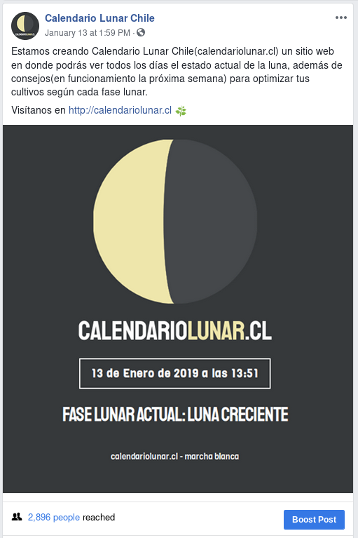

Title: Creando un Calendario Lunar Digital como herramienta de marketing
Date: 2019-01-17 00:00
Category: Blog
Author: Marcelo Cueto
Summary: Me encuentro realizando un Calendario Lunar digital para eliminar las barreras de entrada que tiene la competencia y crear una nueva audiencia.
Facebook_image: images/0002_making_a_marketing_machine/calendariolunar.png

El pasado año 2018 vino hacia mi la idea de realizar un Calendario Lunar digital, esto debido a que mucha gente que conozco compraba de manera recurrente un calendario lunar físico para revisar el estado de la luna en determinada fecha, para poder así utilizar técnicas de [Agricultura Biodinámica](https://es.wikipedia.org/wiki/Agricultura_biodin%C3%A1mica), guiarse por el ciclo lunar y de esa manera obtener mejores siembras, mejor respuesta al transplante y mayores cosechas en cada uno de sus cultivos.

La importancia de la luna en la agricultura es que ésta influye en los flujos de savia de las plantas, lo cual afecta como crecen sus raices, hojas y frutos, por lo cual se vuelve de suma importancia al momento de obtener mejores cosechas. El flujo de savia en las plantas se concentra en las raices cuando es Luna Nueva y en las ramas cuando es Luna Llena, por ejemplo, entonces el calendario lunar se vuelve una guia que permite saber el cuando hacer que(siembra, poda, cosecha) para que tipo de planta.

# Lo existente

Hay múltiples calendarios lunares físicos que se pueden encontrar por un precio de aproximadamente $15000 CLP, que a mi parecer suelen tener los siguientes problemas:

- **Revisar un día en específico requiere ver (al menos) dos páginas distintas:** una del calendario con el tipo de luna en una fecha determinada y otra -por ejemplo- con las recomendaciones para ese día en específico.
- **Debes comprarlo cada año:** ya que los días en el [Calendario Gregoriano](https://es.wikipedia.org/wiki/Calendario_gregoriano) no se corresponden con los días del [Calendario Lunar](https://es.wikipedia.org/wiki/Calendario_lunar).
- **Usualmente tienen un alto costo:** debido a la cantidad de hojas que posee el libro(y debido a que también suelen tener un montón de [arte](https://es.wikipedia.org/wiki/Arte)) deben ser impresos sobre material de alta calidad, lo que los hace caros de imprimir.
- **Usualmente se ven al revés:** se debe hacer un calendario para cada hemisferio, debido a la perspectiva desde la cual se mira la luna en cada uno, debido a que el "crecimiento de la luna"(zona iluminada) es hacia la izquierda en el hemisferio norte y hacia la derecha en el hemisferio sur.

Cuando hablamos de los digitales nos encontramos con interfaces de usuario complicadas más de lo necesario y que no aportan información relevante(al menos de manera sencilla).

# Entrando a competir

Para eliminar esas barreras de entrada -y de paso generar una audiencia nueva interesada en todo lo relacionado con la Agricultura Biodinámica- es que a través del sitio web [calendariolunar.cl](http://calendariolunar.cl) ofreceré lo siguiente:

- **Interfaz sencilla:** solo entrar al index del sitio web permitirá a los usuarios acceder a la información relevante acerca del estado de la luna en determinada fecha y cuales son los hitos importantes en cuanto a estos estados(cuando es la próxima luna llena, luna nueva, que se recomienda hacer en cada fase lunar, etc)
- **Interfaz atractiva(aunque en gustos no hay nada escrito):** busco que la interfaz sea atractiva y para esto además de utilizar una paleta de colores relativos a la luna -tomados de [colourlovers](https://www.colourlovers.com/)- busco mostrar como elemento principal de la web una gran luna centrada que cambia el porcentaje iluminado dependiendo de la fase actual de la luna, además del dominio del sitio(calendariolunar.cl), con lo que busco generar una imagen de marca reconocible.
- **No se debe comprar cada año:** debido a que es un sitio web, no se deberá comprar uno nuevo cada año, basta con que el sitio web siga en funcionamiento para poder acceder a él y sus consejos.
- **Sin costo para el usuario:** los usuarios podrán tener acceso a toda la información relevante respecto a los estados de la luna en cada momento, además de consejos para cada uno de estos, lo que no conllevará ningún desembolso monetario de parte de los usuarios.
- **Incorporación de nuevas características con el tiempo:** debido a la infraestructura lógica actualmente disponible y a que el sitio web se ha creado con los [12 factores](https://12factor.net/es/) en mente, se pueden solucionar problemas de manera rápida así como incorporar nuevas características en poco tiempo, esto debido a que entre despliegue y despliegue el proceso se encuentra en su mayor parte automatizado, lo que además genera un casi nulo downtime.
- **Responsivo:** aún en 2019 existen muchos sitios cuya experiencia en dispositivos móviles es diametralmente distinta a la experiencia en PC o incluso no brindan una experiencia para móviles, es por esto que se busca entregar 1 sola experiencia, sea cual sea el dispositivo desde el cual se visita el sitio web.
- **Abierto a la comunidad:** debido a mi convicción acerca del software libre es que he decidido hacer el [código del sitio disponible públicamente](https://github.com/mcueto/calendariolunar.cl) para que cualquiera pueda aportar a él con mejoras y nuevas características.

**Ofreciendo todas esas mejoras a lo existente busco conseguir una gran audiencia que permita generar publicidad o proyectos relacionados al tema del sitio web:** por ejemplo si el sitio web es visitado usualmente por agricultores se podrian publicitar abonos orgánicos o maquinaria u herramientas especializadas, hay muchas posibilidades que se irán viendo a medida que la audiencia aumente.

# Difundiendo la herramienta de Marketing

Si le damos vueltas en sobre como podriamos lograr que la *herramienta de marketing* llegue a ser lo que queremos quizá pensariamos que estamos ante una [paradoja](https://es.wikipedia.org/wiki/Paradoja): ***¿Como vamos a publicitar una web en donde queremos publicitar otras web/productos/servicios si apenas y estamos partiendo con el proyecto?***.

Si bien las respuestas a la pregunta pueden ser diversas y con diferentes enfoques(como pagar publicidad por ejemplo), creo que es suficiente con ofrecer un buen servicio que resuelva una problematica y que la publicidad sea a través del [boca a boca](https://www.forbes.com/sites/kimberlywhitler/2014/07/17/why-word-of-mouth-marketing-is-the-most-important-social-media/#299bfd1e54a8) de sus usuarios satisfechos. Además de esto se crearán cuentas en redes sociales(facebook / instagram) con el fin de mantener una comunicación directa con la gente interesada en el proyecto, publicitar tanto la existencia del sitio web como de las nuevas características que se vayan añadiendo a éste, además de permitir feedback que permita implementar nuevas y mejores características que la misma comunidad requerirá, generando de paso la fidelización de los mismos usuarios y fomentando la participación y la comunidad.

El sitio web partió su etapa pública el día 13 de enero de 2019, con 18 me gusta en la página de facebook. Al momento de escribir esto, con una sola publicación y sin pagar ningún peso en publicidad la audiencia ya ha crecido a 72 personas.

 El 1 de marzo(o antes) volveré a escribir una publicación en este mismo sitio para contarles del avance de este [experimento](https://es.wikipedia.org/wiki/Experimento).
