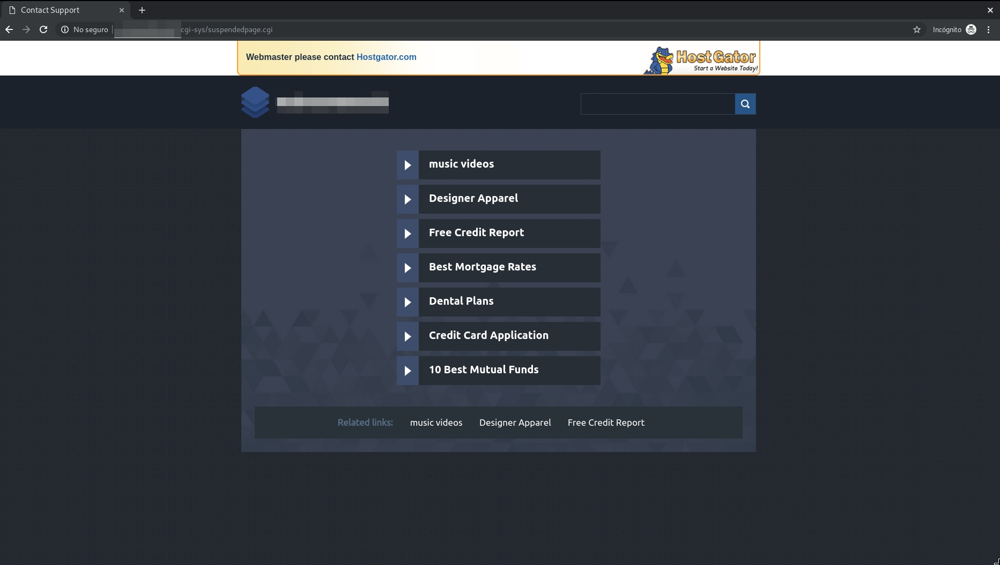

Title: Hostgator secuestró mi cuenta
Date: 2019-04-05 00:00
Category: Blog
Author: Marcelo Cueto
Summary: Tras años de ser su cliente fiel y recomendar a conocidos y clientes el uso de su servicio de hosting, HostGator secuestró mi cuenta obligandome a migrar a otro servicio e infraestructura más confiable.
Facebook_image: images/003_hostgator_kidnapping/facebook.jpg

Dicen que no hay que escupir al cielo porque cuando más uno cree que ciertas cosas no le sucederán es más probable que lo hagan, o al menos "te dolerán más" si es que ocurren. Ese es el dicho en el que pensé cuando me sucedió lo que les voy a contar a continuación.

# La historia
Hace un par de años llegó a mi un prospecto de cliente con un problema: GoDaddy le estaba cobrando de más por un par de dominios que "se supone" estaban incluidos en el precio del hosting, si éste queria cambiar las configuraciones de tales dominios. Averiguando en el momento "descubrí" que ["secuestrar sitios"](http://www.webhostingtalk.com/showthread.php?t=524083) era una estrategia de lo más normal de la empresa y le recomendé a mi cliente comprar un dominio [.cl](https://nic.cl) con el mismo nombre de los otros dominios y cambiar el hosting a HostGator. Esto tendria un mayor valor inicial(respecto a lo que pagaban en HostGator) pero debido al bajo requerimiento de los sitios(son sitios estáticos) el costo de mantenimiento anual se mantendria bajo, pues estos sitios estarian junto a mis sitios personales. El cliente aceptó, los cambios se hicieron, adios GoDaddy y tod@s felices, sobre todo yo, porque HostGator era una gran empresa que "no tenia esas prácticas mafiosas"(según el YO de ese tiempo).

# El secuestro
Corria un tranquilo mes de Marzo de 2019, cuando repentinamente todos los sitios que tenia alojados en mi cuenta de Hosting de "El Lagarto"(HostGator) dejaron de funcionar, **al acceder a los sitios aparecia un mensaje de "página suspendida" como si no se hubiera pagado el Hosting** o algo similar, además de mostrar publicidad que beneficia directamente a HostGator. Al mismo tiempo se me intentaba contactar desde el sitio SiteLock porque estaban "preocupados" porque "mi sitio web habia sido infectado con malware" y **ellos podian prestar un servicio para eliminar el malware y "proteger mi sitio de las amenazas de allá afuera"** en el futuro(mientras pagara una suscripción mensual de un valor mucho más alto al de mantener el hosting funcionando, como no podia ser de otra manera).

# El pretexto
Según l@s agentes de SiteLock-que a todo esto pertenece a los mismos dueños de "El Lagarto"- **la única manera de poder volver a tener mis sitios activos era contratando estos servicios**, debido a que mi hosting podria ser reinfectado si no lo hacia.

Al preguntarles cuales eran los archivos infectados que ellos habian detectado, los dominios afectados o cualquier otra información real simplemente usaban su conocimiento técnico evadiendo una respuesta formal, la entrega de evidencia usada para haber tomado la decision de bloquear la cuenta e incluso amenazándome de demandas por injuria, además de las constantes preguntas del estilo **"¿Como va a mantener su sitio seguro si no contrata nuestro servicio de protección de malware?"** o **"¿Tiene ud un sistema de monitoreo para detectar que su sitio no está infectado?"** que hacian poco fluida la comunicación, simplemente no querian ayudar, solo querian vender. ¿Servicio al Cliente? no lo creo.

La misma "solución" me dieron distint@s agentes, distintos días por distintos medios: **tenia que pagarles una suscripción y pagar al menos 1 año adelantado para poder recuperar mis sitios**. Mi cuenta habia sido secuestrada.

# La solución
Ante la actitud mafiosa de "El Lagarto" y SiteLock y después de haber hecho "todas las gestiones correspondientes" a un trato entre una empresa y un cliente tomé la decisión de hacer lo que correspondia: **levantar una infraestructura lógica propia, donde tuviera más control sobre lo que pasa dentro de ésta** y en donde se le hiciera más dificil a mi "proveedor de servicios de alojamiento" la realización de acciones mafiosas como las realizadas por GoDaddy y HostGator.

Es así como **comencé un proceso de migración a un VPS de DigitalOcean** con VestaCP en su corazón y ahora los sitios alojados ahí **pueden utilizar más características para brindar un mejor servicio manteniendo los costos bajos**, por ejemplo ahora se pueden generar certificados con LetsEncrypt sin tener que pagar extra, además de autorenovarse, simplificando y mejorando la experiencia para mis clientes, sus clientes y para mi. Adios HostGator y tod@s estamos felices de nuevo, con excepción de ellos claro. Esperemos que DigitalOcean no decepcione y que como "industria TI" demos el ejemplo de como debiera ser la entrega de servicios, hablando siempre con la verdad y sin meter letra chica en los términos de servicio o actuar como mafiosos.

---
**NOTA:** Hay mucha evidencia de HostGator haciendo lo mismo, te bloquean el acceso a tus sitios diciendo que ha sido hackeado o tiene virus, te cobran un rescate y si no lo pagas estás obligado a migrar. Una lástima para un sistema que se deberia basar en la confianza y no en el abuso de poder. Dejo links más abajo como evidencia:

- [Link 1 - "it looks like sitelock is scamming people"](https://www.whitefirdesign.com/blog/2016/05/03/it-looks-like-sitelock-is-scamming-people/)
- [Link 2 - "scam alert how hostgator attempted to extort 200 out of me for sitelock"](https://www.hermesthemes.com/scam-alert-how-hostgator-attempted-to-extort-200-out-of-me-for-sitelock/)
- [Link 3 - "ugly truth about hostgator and sitelock scam you should know today"](http://trendxplore.net/ugly-truth-about-hostgator-and-sitelock-scam-you-should-know-today/)
